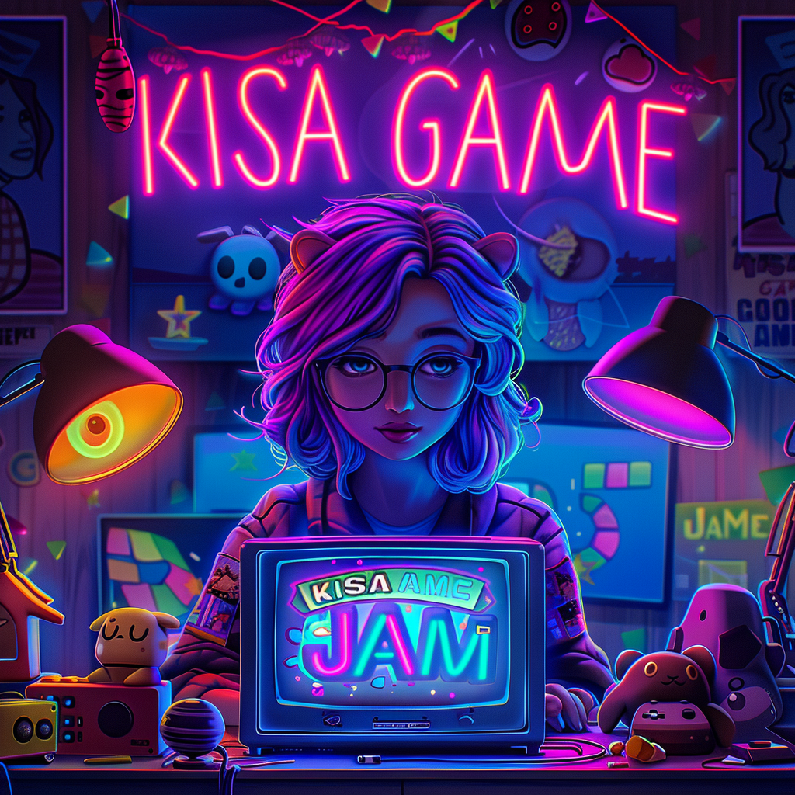

# Game Jam Starter



## Introduction

This project is the starter for Kisa Game Jam, where everything is open to decide - from the theme to the core gameplay. We aim to create a 2D top-down multiplayer game using Phaser, GridEngine, and Colyseus, served with Vite. The game features a welcome screen, a strategy map where players can move around and enter tactical battles, and a tactical map where players fight against enemies in real-time.

The game is designed to have three main levels of interaction:

1. **Welcome Screen**: The game is presented with graphics and music, and a big start button to begin the game.

2. **Strategy Map**: A world view is presented as a 64x64 grid-based map using GridEngine. Tiles can be walkable or non-walkable, with walkable tiles being either green (owned by forces of good) or red (owned by forces of evil). Every minute, the game server allows the forces of evil to expand to a random walkable tile adjacent to an existing tile owned by the forces of evil. Players can join the game, move around the map using WASD keys, and enter tactical battles by pressing the spacebar. When multiple players are on the same tile, the number of players is displayed instead of their avatars. Players represent the forces of good and cannot shoot on the strategy map.

3. **Tactical Map**: Each room on the strategy map is represented as a separate 64x64 grid-based map using GridEngine. If a room is owned by the forces of evil, enemies will be present. Players spawn in random positions and can quit the battle at any time by pressing the Esc key. Players can move around walkable tiles using WASD keys and shoot in the direction of the mouse cursor by pressing the spacebar. Enemies spawn randomly after a random delay if the room is owned by evil. If all enemies are defeated, the room is then owned by the forces of good (the players).

## Architecture

The game is built using a client-server architecture, with the client-side using Phaser and GridEngine for rendering and grid-based movement, and the server-side using Colyseus for handling multiplayer functionality and game state synchronization.

### Client-side

- **Phaser**: A powerful 2D game framework for rendering graphics, handling input, and managing game scenes.
- **GridEngine**: A plugin for Phaser that enables grid-based movement and pathfinding.
- **Vite**: A fast build tool that serves the client-side code and assets during development.

### Server-side

- **Colyseus**: A multiplayer game server framework that simplifies the creation of real-time multiplayer games.
- **TypeScript**: The server-side code is written in TypeScript for type safety and improved development experience.

### Communication

The client and server communicate using WebSocket, with Colyseus handling the synchronization of game state and events between connected clients.

### Entities

The game includes three main entities: players, enemies, and shots. Each entity has properties such as x/y position, speed, and direction of travel.

- **Players**: Players have names and a mouse position that is updated on mouse move and converted to GridEngine coordinates.
- **Enemies**: Enemies use GridEngine's pathfinding to move towards the players. When an enemy is on a tile adjacent to a player, they can attack, decreasing the player's health.
- **Shots**: Players can shoot in the direction of the mouse position.

### Multiplayer

The game utilizes a multiplayer server built with Colyseus.js. The server manages all the game rooms and their states, which include the entities (players, enemies, and shots).

### Map Grids

The game maps are defined using text files. Each text file represents a 64x64 grid, where each character in the file corresponds to a specific tile type. The game includes a component that converts these text files into GridEngine maps. In this version of the game, there are two types of tiles: Wall (denoted by "#") and Floor (denoted by " "). Walls are non-walkable, while floors are walkable.

## Version Control with Git

To ensure smooth collaboration and version management, this project uses Git. Here are some basic instructions to get started with Git for this project.

### Setting Up Git

1. **Install Git**: If you haven't already, download and install Git from [git-scm.com](https://git-scm.com/).

2. **Register on Github**:
   - Create a new account on [Github](https://github.com/).

3. **Configure Git**:
   - Open Terminal (macOS/Linux) or Git Bash (Windows).
   - Set your user name with `git config --global user.name "Your Name"`.
   - Set your email address with `git config --global user.email "your_email@example.com"`.

### Cloning the Repository

To work on the project, you need to clone the repository to your local machine.

- **Clone the Repository**:
  - Navigate to the directory where you want to place the project.
  - Run `git clone https://github.com/martinkallstrom/game-jam-starter.git`.
  - Change into the project directory with `cd game-jam-starter`.

## How to install node on Mac, Windows or Linux

Installing Node.js on your system is the first step to getting this game up and running. Here's how you can install Node.js on macOS, Windows, and Linux.

### macOS

1. **Using Homebrew**:
   - Open the Terminal by pressing Command + Space and typing "Terminal".
   - If you don't have Homebrew installed, you can install it by running:

     ```bash
     /bin/bash -c "$(curl -fsSL https://raw.githubusercontent.com/Homebrew/install/HEAD/install.sh)"
     ```

   - Once Homebrew is installed, you can install Node.js by running:

     ```bash
     brew install node
     ```

### Windows

1. **Use the Node.js installer**:
   - Visit the [Node.js website](https://nodejs.org/) and download the Windows installer.
   - Open the installer and follow the prompts to install Node.js and npm.

### Linux

1. **Using Node Version Manager (nvm)**:
   - Open the Terminal.
   - Install nvm by running:
  
     ```bash
     curl -o- https://raw.githubusercontent.com/nvm-sh/nvm/v0.39.1/install.sh | bash
     ```

   - Restart your terminal.
   - Install Node.js by running:

     ```bash
     nvm install node
     ```

2. **Using a package manager**:
   - For Debian and Ubuntu based distributions:

     ```bash
     sudo apt-get update
     sudo apt-get install nodejs npm
     ```

   - For Fedora and RedHat based distributions:

     ```bash
     sudo dnf install nodejs
     ```

## Installation

1. Clone the repository:

   ```bash
   git clone https://github.com/martinkallstrom/game-jam-starter.git
   ```

2. Navigate to the project directory:

   ```bash
   cd game-jam-starter
   ```

3. Install dependencies:

   ```bash
   npm install --force
   ```

4. Start the development server:

   ```bash
   npm run dev
   ```

5. Open the game in your browser at `http://localhost:3000`.

6. To start the Colyseus server, navigate to the `server` directory and run:

   ```bash
   npm run start
   ```

Make sure you have Node.js and npm installed on your machine before running the above commands.

## Technologies

### Phaser

Phaser is a fast, free, and fun open-source framework for creating 2D games in JavaScript. It provides a rich set of features for rendering graphics, handling input, and managing game scenes, making it an ideal choice for building 2D games.

Phaser is used for rendering the game graphics, handling player input, and managing the game scenes (welcome screen, strategy map, and tactical map).

### GridEngine

GridEngine is a plugin for Phaser that adds grid-based movement and pathfinding capabilities to your game. It simplifies the implementation of grid-based mechanics and allows for easy creation of tile-based game worlds. In this project, GridEngine is used for creating the grid-based maps for both the strategy map and tactical battles. It handles player and enemy movement on the grid, as well as pathfinding for enemy AI.

### Colyseus

Colyseus is a multiplayer game server framework that simplifies the creation of real-time multiplayer games. It provides a powerful and easy-to-use API for handling client connections, room management, and state synchronization, making it an excellent choice for building multiplayer games.

In this project, Colyseus is used for managing the multiplayer aspects of the game, including synchronizing game state across connected clients, handling player actions, and managing game rooms.

### Vite

Vite is a fast build tool that serves the client-side code and assets during development. It offers lightning-fast cold server start, instant hot module replacement (HMR), and optimized builds for production, providing a smooth and efficient development experience. Vite is used for serving the client-side code and assets, enabling quick development iterations and improved developer experience.

## Todo

- [ ] Make something show on the Strategy Map
- [ ] Make a skeleton for the Tactical Map
- [ ] Make rudimentary player movement
- [ ] Initiate multiplayer with Colyseum

Feel free to contribute to the project by submitting pull requests or reporting issues on the GitHub repository. Your contributions and feedback are highly appreciated!

## Folder Structure

The project follows a well-organized folder structure to ensure code maintainability and separation of concerns. Here's an overview of the main directories and their purposes:

```txt
├── assets/
│   ├── images/
│   ├── audio/
│   └── tilemaps/
├── maps/
├── server/
│   ├── src/
│   └── package.json
├── src/
│   ├── scenes/
│   │   ├── WelcomeScene.ts
│   │   ├── StrategyMapScene.ts
│   │   └── TacticalMapScene.ts
│   ├── entities/
│   │   ├── Player.ts
│   │   ├── Enemy.ts
│   │   └── Shot.ts
│   ├── utils/
│   │   └── MapLoader.ts
│   └── main.ts
├── types/
├── index.html
├── package.json
├── tsconfig.json
└── vite.config.ts
```

- `assets/`: This directory contains all the game assets, such as images, audio files, and tilemaps. It is further divided into subdirectories for better organization.
  - `images/`: Contains all the image files used in the game, such as character sprites, tiles, and UI elements.
  - `audio/`: Contains all the audio files used in the game, such as sound effects and background music.
  - `tilemaps/`: Contains the tilemap files that define the layout and properties of the game maps.

- `maps/`: This directory contains the text files that define the grid-based map layouts for the strategy map and tactical battles. Each text file represents a specific map layout.

- `server/`: This directory contains the server-side code and configuration files for the Colyseus multiplayer server.
  - `src/`: Contains the TypeScript source code for the server, including room handlers, game state management, and server-side logic.
  - `package.json`: The package configuration file for the server, specifying dependencies and scripts.

- `src/`: This directory contains the client-side source code for the game, written in TypeScript.
  - `scenes/`: Contains the Phaser scene classes for different parts of the game, such as the welcome screen, strategy map, and tactical map.
  - `entities/`: Contains the entity classes for players, enemies, and shots, defining their properties and behaviors.
  - `utils/`: Contains utility functions and classes used throughout the game, such as the map loader for converting text files to GridEngine maps.
  - `main.ts`: The entry point of the client-side application, where the Phaser game is initialized and configured.

- `types/`: This directory contains TypeScript type definitions and declaration files specific to the project.

- `index.html`: The main HTML file that serves as the entry point for the game in the browser.

- `package.json`: The package configuration file for the client-side application, specifying dependencies, scripts, and other project metadata.

- `tsconfig.json`: The TypeScript configuration file that specifies the compiler options and settings for the project.

- `vite.config.ts`: The configuration file for Vite, the build tool used for serving the client-side code and assets during development.

This directory structure provides a clear separation between client-side and server-side code, as well as organizing assets, maps, and utility functions in their respective directories. It promotes code modularity, reusability, and maintainability, making it easier for developers to navigate and understand the codebase.

### Making Changes

1. **Add Changes**:
   - After making changes, stage them with `git add .` to add all changes or `git add file-name` to add specific files.

2. **Commit Changes**:
   - Commit your changes with `git commit -m "Commit message describing the changes"`.

### Pushing Changes

- **Push to Remote**:
  - Push your changes to the remote repository with `git push origin feature-branch-name`.

### Pulling Updates

- **Pull the Latest Updates**:
  - Regularly pull updates from the main branch to keep your local repository up to date with `git pull origin main`.

Remember to regularly commit your changes and keep your branches up to date with the main branch to minimize merge conflicts.
